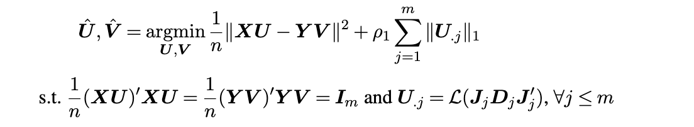

# LocusCCA.CVRtesting:  A Low-Rank, Sparse Canonical Correlation Analysis and Canonical Variate Regression Testing Framework for Brain Connectivity Analysis

`locusCCA.CVRtesting` is an R package implementing a two-stage statistical framework (Locus-CCA + CVR testing) designed for analyzing associations between brain connectivity and cognitive, behavioral, or clinical outcomes. The approach addresses challenges inherent in brain connectome analyses such as high dimensionality and noise, providing interpretable and powerful insights into neurodevelopmental and neuropsychiatric studies.


-   I. Installation
-   II. Method
-   III. Detailed Descriptions of the Functions
-   IV. A Toy Example

## I. Package Installation
You can easily install `locusCCA.CVRtesting` from GitHub with:

```r
if (!requireNamespace("devtools", quietly = TRUE))
  install.packages("devtools")
devtools::install_github("Emory-CBIS/locusCCA.CVRtesting")
library(locusCCA.CVRtesting)
```


## II. Method

###  Locus-CCA Method
Locus-CCA (**Low-rank Characterization of Brain Connectivity Matrices with Universal Sparsity by Canonical Correlation Analysis**) is a specialized form of Canonical Correlation Analysis designed explicitly for brain connectivity data. The method uses a low-rank decomposition combined with sparsity-inducing penalties, enabling it to identify robust, interpretable connectivity patterns associated with clinical or cognitive variables. 

Formally, Locus-CCA identifies $m$  canonical directions  𝐔 and 𝐕 by solving:



where:

- **X** is an $n \times p$ stacked brain connectivity data matrix, where $p = node(*node-1)/2$ represents the length of the vectorized upper triangle  of connectivity matrix of size $node \times node$.
- **Y** is an $n \times q$ matrix of clinical or cognitive variables.
- 𝐔 and 𝐕 are canonical direction weight matrices for connectivity and clinical variables, with dimensions $p \times m$ and $q \times m$ respectively.
- **𝐉ⱼ** and **Dⱼ** are low rank parameters, with dimensions $p \times R_j$ and $R_j \times R_j$ respectively. $R_j$ is latent rank of $j$ th canonical direction on brain connectivity.
- The function $\mathcal{L}(\cdot)$ extracts the vectorized upper-triangular portion from symmetric connectivity trait matrices.
- $\rho_1$ is the regularization parameters penalizing the sparisty of 𝐔. 

#### Method Highlights

- **Low-rank factorization**:  
  Locus-CCA employs low-rank decomposition to capture intrinsic, structured patterns within connectivity matrices. This efficiently reduces model complexity and enhances interpretability.

- **Universal Sparsity Regularization**:  
  Sparsity regularization (L1, Hardthreshold or SCAD penalties) is applied element-wise to canonical weights, ensuring robust and interpretable connectivity patterns that represent meaningful neural circuitry associated with clinical or behavioral phenotypes.

- **Canonical Correlation Maximization**:  
  Canonical directions (**XU**, **YV**) derived from Locus-CCA are optimized to achieve maximum canonical correlation, capturing the strongest possible linear relationships between brain connectivity and clinical/behavioral outcomes.

### CVR Testing Method

Canonical Variate Regression (CVR) Testing is a robust statistical procedure designed to evaluate the significance of canonical directions derived from Locus-CCA in predicting clinical or behavioral outcomes. Specifically, CVR testing assesses whether each identified canonical connectivity pattern (**XU**) significantly contributes to explaining variation in the univariate clinical or behavioral measures (**z**).

Formally, for each canonical direction  $j \leq m$, CVR testing calculates a test statistic $T_j$:


$$T_j = \frac{\sqrt{n}\mathbf{S}_j}{\sqrt{\mathbf{I}_j}} \xrightarrow{d} N(0,1)$$

*Comprehensive and complete methodological explanations of the CVR Testing framework are described in detail in our accompanying research paper (in preparation).*


<!--
\mathbf{S}_j = \frac{1}{n \hat{\sigma}^2}\left(\mathbf{z}-\hat{\mathbf{z}}\right)^\top\left(\mathbf{f}_j - \hat{\mathbf{f}}_j\right),\quad
\mathbf{I}_j = \frac{1}{n \hat{\sigma}^2}\left(\|\mathbf{f}_j\|^2 - \mathbf{f}_j^\top\hat{\mathbf{f}}_j\right),
$$

and

- $$\mathbf{z}$$ is the observed $$n$$-dimensional clinical or behavioral outcome vector.
- $$\hat{\mathbf{z}}$$ represents predictions from a Lasso regression of $$\mathbf{z}$$ onto the connectivity matrix $$\mathbf{X}$$.
- $$\hat{\sigma}^2$$ is the estimated residual variance from the Lasso regression.
- $f_j$ is the $j$ th canonical factor computed as the standardized projection of connectivity matrix onto the canonical direction:  $f_j = {XU_{.j}}$
- $$\hat{\mathbf{f}}_j$$ represents predictions of $$\mathbf{f}_j$$ obtained by regressing $$\mathbf{f}_j$$ onto the remaining connectivity features ($$\mathbf{X}$$) via a second Lasso regression to control for collinearity among predictors.
-->


#### Method Highlights

- **Statistical Significance Testing**:  
  The CVR testing procedure provides formal hypothesis tests for assessing the statistical significance of each canonical variate, determining whether connectivity patterns identified by Locus-CCA significantly predict clinical or behavioral outcomes.

- **Account for High Dimensionality and Edge Dependence**:  
  CVR transforms the high-dimensional testing challenge into testing an aggregated scalar statistic, effectively accounting for dependency structures among brain connectivity edges.

- **Reduced Multiple Testing Burden**:  
  By evaluating canonical variates rather than individual connectivity edges, CVR greatly reduces multiple comparison issues, enhancing statistical power and interpretability of findings.

By integrating Locus-CCA with CVR testing, this approach provides a comprehensive, statistically rigorous framework for linking complex brain connectivity data to meaningful clinical and behavioral phenotypes.


### Functions Overview
The structure of the package is as follows, and detailed descriptions of the function arguments are provided in the section below:

-   **Main Function:**
    -   `Locus_CCA`: performs Locus_CCA on brain connectivity and clinical/behavorial variables from the same group of subjects.
    -  `CVR_testing`: Peforms CVR testing based on the results from Locus_CCA.
-   **Tuning Parameter Selection:**
    -   `bic_cal()`: selects the tuning parameters $\rho_1$.
-   **Helper Functions:**
    -   `Ltrinv` and `Ltrans`: transform the brain connectivity to vectorized upper triangle and transform it back.
    - `plot_conn`:  plots the canonical weights on brain connectivity in the form of heatmap for adjancency connectivity matrix.
## III. Detailed Descriptions of the Functions

### 1. Locus_CCA function

```         
Locus_CCA(X, Y, node, m, rho, gamma = 2.1,
                         penalt = 'L1', proportion = 0.9
                         , silent = FALSE, tol = 1e-3)
```

-   `X`: Group-level brain connectivity data represented as a matrix of dimension $n \times p$, where $n$ denotes the number of subjects, and $p$ represents the number of edges in the connectivity network. To construct `X` from connectivity matrices, suppose each matrix is a $node \times node$ symmetric matrix. We use the `Ltrans()` function to extract the upper triangular elements of each connectivity matrix and convert them into a row vector of length $p = (node-1)*node/{2}$. We then concatenate these vectors across  subjects to obtain the group connectivity data `X`, which has dimensions $n \times p$.
-   `Y`: Group-level clinical/behavioral subscale scores for the same subjects in `X`, the dimension is $n\times q$.
-   `node`: The number of nodes. Note that $p$ needs to be equal to $(node-1)*node/{2}$.
-   `m`: The number of canonical correlation components to extract.
-   `rho`: A tuning parameter for the element-wise penalty on 𝐔.
-   `gamma`: A tuning parameter only used if  SCAD penalty is used, default to be 2.1.
-   `penalt`: The option for the penalization function for the sparsity regularization for the canonical correlation directions on brain connectivity. Users can choose `"NULL"`,  `"Hardthreshold"`, `"L1"`, or `"SCAD"` (smoothly clipped absolute deviation), introduced by [Fan and Li, 2001](https://www.jstor.org/stable/3085904). Defaults to `"L1"`.
-   `proportion`: A proportional tuning parameter ranging from 0 to 1 to determine the number of ranks for modeling each connectivity trait. The value of `rho` represents the closeness of the connectivity traits estimated with and without the low-rank structure. A higher value of `rho` will lead to a higher rank. Defaults to 0.9.
-  `silent`: If `FALSE`, print out the training progress. Defaults to `FALSE`.
-   `tol`: A number describing the tolerance for change on parameters 𝐔 and 𝐕  .

The `Locus_CCA` function serves as the primary function in the algorithm, implementing the novel CCA method for investigating the association between brain network connectivity matrices and clinical/behavioral subscale scores using low-rank structure with uniform sparsity. Users can provide the group-level concatenated connectivity data and clinical/behavioral subscale as input, along with specifying parameters such as the number of connectivity traits to extract, the number of nodes under consideration, etc. The output of the `Locus_CCA` function is a list comprising 4 components:

-   `U`: The canonical correlation directions on brain connectivity with  dimension $p \times m$.
-   `V`: The canonical correlation directions on subscale scores with  dimension $q \times m$.
-   `CC`: A m by m matrix. Canonical correlations between the each corresponding projection, i.e the pairwise correlations between columns in $XU$ and $YV$.
-   `R`: A list of rank $R_j$, where `R[j]` contains the rank of the $i$th sub connectivity matrix.

### 2. CVR_testing function

```         
CVR_testing(U, X, z, lambda1 = NULL, lambda2 = NULL)
```

- `U`: The canonical correlation directions on brain connectivity with dimension $p \times m$, i.e., `U` from `Locus_CCA`.
- `X`: Group-level brain connectivity data represented as a matrix of dimension $n \times p$, where $n$ denotes the number of subjects, and $p$ represents the number of edges in the connectivity network.
- `z`: A numeric response vector (n x 1).
- `lambda1`: A numeric value for Lasso penalty in coefficients estimation. If `NULL`, it is determined using cross-validation.
- `lambda2`: A numeric value for constrained optimization in score calculation. If `NULL`, it is  determined by our procedure.

The `CVR_testing` function characterize the significance of each  brain connectivity canonical variant (**XU**) in explaining the one overall disorder or behavior score.  The function takes the arguments including canonical correlation directions on brain connectivity (estimated U from Locus_CCA), the group-level brain connectivity data **X**, and an univariate response (usually overall evaluation, such as ADHD overall score). The function outputs the testing statsitics of CVR testing of all m canonical components. 

- `T_stats`: A length m vector containing the test statistics for each canonical variants of brain connectivity. Each entry  follows a asymptotic normal distribution. 


### 3. BIC_cal function

```
BIC_cal(X, Y, U, V)        
```

- `X`: Group-level brain connectivity data represented as a matrix of dimension $n \times p$, where $n$ denotes the number of subjects, and $p$ represents the number of edges in the connectivity network.
- `Y`: Group-level clinical/behavioral subscale scores for the same subjects in `X`, the dimension is $n\times q$.
- `U`: The canonical correlation directions on brain connectivity with  dimension $p \times m$, or the outcome `U` from `Locus_CCA`.
- `V`: The canonical correlation directions on subscale scores with  dimension $q \times m$, or the outcome `V` from `Locus_CCA`.

`BIC_cal function serves as a valuable guide for tuning the parameters $\rho$.  The function outputs a single BIC value.  A model with lower BIC value is prefered. However, it is worth noting that in certain datasets, the choice may not be straightforward solely based on BIC. Tuning parameters can also be selected based on visual inspection of the extracted connectivity traits to achieve the desired level of sparsity and appealing neuroscience interpretation.


## IV. A Toy Example

In this section, we provide a toy example to demonstrate the implementation of the package. We generated toy example data **X**, **Y**, and **z** based on  estimated lantent connectivity traits from real brain connectivity and real clinical subscale dataset on cognition. 
Specifically, we generated connectivity matrices based on the real connectivity traits, using [Power's brain atlas](https://www.ncbi.nlm.nih.gov/pmc/articles/PMC3222858/). Each connectivity  trait is symmetric with dimensions of $node \times node$, where $node = 264$ is the number of nodes.   The input $X$ matrix would be of dimension $n \times p$, where $n = 300$ subjects and $p = V(V-1)/2$ edges. Suppose we have $n$ connectivity matrices from each of the $n$ subjects, where each matrix is a $node \times node$ symmetric matrix. To generate our input matrix $Y$, we use the `Ltrans()` function to extract the upper triangular elements of each  matrix and convert them into a row vector of length $p = \frac{(node-1)node}{2}$. We then concatenate these vectors across subjects to obtain the group connectivity data **X**. Similarly, **Y** is a matrix of subscale scores 

``` r
# library 
library(locusCCA.CVRtesting)
library(MASS)  # For ginv() function in data generating only
# generate the toy example data 
S_real_agg <- readRDS(system.file("data", "S_real_agg.rds", package = "locusCCA.CVRtesting"))
  original_Y <- readRDS(system.file("data", "original_Y.rds", package = "locusCCA.CVRtesting"))

# Define parameters
n <- 300
q <- 10
p <- ncol(S_real_agg)
m <- 6
node <- 264
# Simulate X and Y using known structures
# Generate synthetic signals based on the real dataset
U <- t(S_real_agg[ 1:m,]) / 1000
sample1 <- sample(2:13, q)
eigen_Y <- eigen(t(original_Y[, sample1]) %*% original_Y[, sample1])
V <- eigen_Y$vectors[ sample(1:10, q),sample(1:10, m)]

# Simulate X, Y, and z using known structures
set.seed(111)
fx <- matrix(rnorm(n * m, 0, 1), nrow = n)
fy <- fx + matrix(rnorm(n * m, 0, 0.6), nrow = n)
X <- 500 * fx[, 1:m] %*% (ginv(U)) + matrix(rnorm(n * p, 0, 0.01), nrow = n)
Y <- fy[, 1:m] %*% ginv(V) + matrix(rnorm(n * q, 0, 0.01), nrow = n)
weights = rnorm(2,1,0.1)
component = sample(1:6,2)
beta =2000*apply((U[,component] %*% diag(weights)), 1, sum)
z = X %*% beta + rnorm(n,sd = 0.1)

  
# check the dimension
dim(X)
dim(Y)
```

We propose to select the number of canonical correlation components  $m$  based on the  number of PCs needed to explain 95% variance of **Y**.

```r
determine_pca_components <- function(Y, variance_threshold = 0.95) {
  # Perform PCA
  pca_result <- prcomp(Y, center = TRUE, scale. = TRUE)
  
  # Calculate proportion of variance explained
  variance_explained <- pca_result$sdev^2 / sum(pca_result$sdev^2)
  
  # Compute cumulative variance explained
  cumulative_variance <- cumsum(variance_explained)
  
  # Find the number of components needed
  num_components <- min(which(cumulative_variance >= variance_threshold))
  
  return(list(num_components = num_components,
              cumulative_variance = cumulative_variance))
}
determine_pca_components(Y)
```

Next, we proceed to use the BIC-type criterion to select the hyperparameters `rho`. In this toy example, we  explore various values for $\rho$ to observe their impact on the BIC value. We recommend initially considering the range $seq(0, 0.05, 0.005)$ to evaluate the BIC.

``` r
# bic selection
rho_seq = seq(0, 0.05, 0.005)
BIC_list = c()
for (rho in rho_seq) {
    result_bic = Locus_CCA(X, Y, node = node, m = m, rho =rho,
                      penalt = "L1", proportion = 0.95,
                      silent = FALSE, tol = 1e-3)
  BIC_list = c(BIC_list,BIC_cal(X,Y,result_bic$U,result_bic$V))}
rho = rho_seq(which.min(BIC_list))
```


It is worth noting that the BIC criterion serves as a valuable guide in selecting the tuning the parameters $\rho$. However, the choice may not always be straightforward solely based on BIC in practice. Therefore, besides the BIC criterion, users can also employ supplementary selection strategies, such as specifying tuning parameters based on the desired sparsity level and the neuroscience interpretations they aim to achieve in the extracted connectivity traits.


Next, we perform the Locus-CCA using the parameters we have just selected.

``` r
## Run Locus-CCA 
result <- Locus_CCA(X, Y, node = node, m = m, rho = rho,
                      penalt = "L1", proportion = 0.95,
                      silent = FALSE, tol = 1e-3)
print(dim(result$U)) #p by m
print(dim(result$V)) #q by m
print(result$CC) #canonical correlation matrix
```
We visualize the canonical direction weights on brain connectivity  based on the Power's atlas. Please note that the visualization code is prepared based on the Power's atlas, and please modify as needed if other atlases are used. 

```r
plot_conn(Ltrinv(result$U,node,F))
```

The CVR testing procedure is then implemented to evaluate the significance of each canonical variants in characterizing the overall response **z**, which gives T_stats of m canonical components. 

## Run CVR testing 
```r
T_stats <- CVR_testing(result$U, X, z)
p.adjust(2*(1-pnorm(abs(T_stats))),,method='fdr') #adjusted p-values using FDR correction to correct multiple (m) testing.
```


